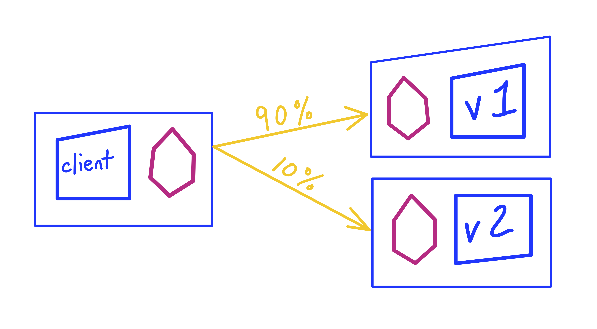

A canary deployment is a strategy for safely rolling out a new version of a service. With Istio, you can use percentage-based [traffic splitting](https://istio.io/docs/concepts/traffic-management/#routing-versions) to direct a small amount of traffic to the new version. Then you can run a [canary analysis](https://cloud.google.com/blog/products/devops-sre/canary-analysis-lessons-learned-and-best-practices-from-google-and-waze) on v2 (like check latency and error rate), and finally direct more traffic at the new version until it's serving all traffic.




```YAML
apiVersion: networking.istio.io/v1alpha3
kind: VirtualService
metadata:
  name: helloworld
spec:
  hosts:
    - helloworld
  http:
  - route:
    - destination:
        host: helloworld
        subset: v1
      weight: 90
    - destination:
        host: helloworld
        subset: v2
      weight: 10
```

```YAML
apiVersion: networking.istio.io/v1alpha3
kind: DestinationRule
metadata:
  name: helloworld
spec:
  host: helloworld
  subsets:
  - name: v1
    labels:
      version: v1
  - name: v2
    labels:
      version: v2
```