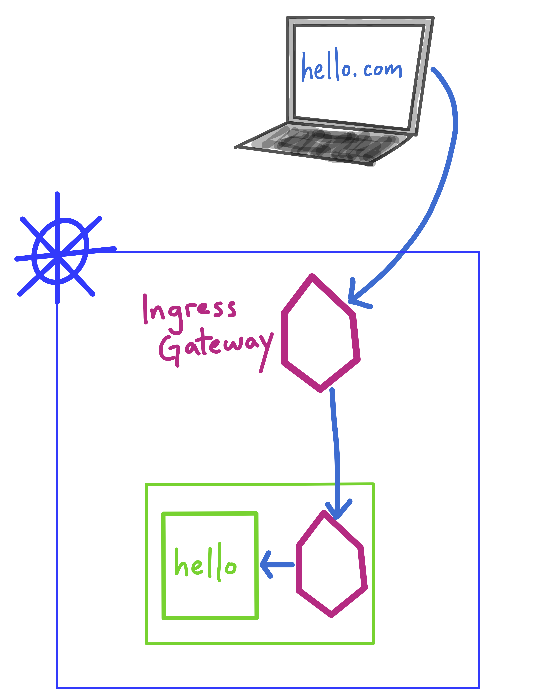

Ingress traffic refers to traffic entering the mesh from outside the cluster. Kubernetes [provides](https://kubernetes.io/docs/concepts/services-networking/service/#loadbalancer) [ways](https://kubernetes.io/docs/concepts/services-networking/ingress/) to handle ingress traffic. With Istio, you can instead manage ingress traffic with a **Gateway**.

A [Gateway](https://istio.io/docs/reference/config/networking/v1alpha3/gateway/) is a standalone set of Envoy proxies that load-balance inbound traffic. Istio deploys a default `IngressGateway` with a public IP address, which you can configure to expose applications inside your service mesh to the Internet.

Istio Gateways have two key advantages over traditional Kubernetes Ingress. Because a Gateway is another Envoy proxy, you can use Istio to configure Gateway traffic in the same way you would configure east-west traffic between services (traffic splitting, redirects, retry logic).

Gateways also forward metrics (request rate, error rate) just like [sidecar](https://istio.io/docs/concepts/what-is-istio/#envoy) proxies, allowing you to view Ingress traffic in [a service graph](https://istio.io/docs/tasks/telemetry/kiali/#generating-a-service-graph), and set fine-grained [SLOs](https://landing.google.com/sre/sre-book/chapters/service-level-objectives/) on frontend services directly serving clients.

Let's see Gateways in action.




Here, the `hello` application runs in a container, inside a Pod. The Pod has an injected Istio sidecar proxy container. A Kubernetes Service called `hello` fronts this Pod. We want to direct inbound traffic from `hello.com` to the `hello` Service.

First we need a `Gateway` resource, which opens port `80` in the default Istio `IngressGateway`, for all hosts resolving from the `hello.com` domain.

```YAML
apiVersion: networking.istio.io/v1alpha3
kind: Gateway
metadata:
  name: hello-gateway
spec:
  selector:
    istio: ingressgateway # use the default IngressGateway
  servers:
  - port:
      number: 80
      name: http
      protocol: HTTP
    hosts:
    - "hello.com"
```

(**Note**: on your own, you'll still have to resolve the DNS for that host to the Istio `IngressGateway` external IP address.)

Second, we need a [`VirtualService`](https://istio.io/docs/tasks/traffic-management/ingress/ingress-control/) to direct traffic from the `IngressGateway` to the `hello` backend Service, running in the `default` namespace on port `80`.

```YAML
apiVersion: networking.istio.io/v1alpha3
kind: VirtualService
metadata:
  name: frontend-ingress
spec:
  hosts:
  - "hello.com"
  gateways:
  - hello-gateway
  http:
  - route:
    - destination:
        host: hello.default.svc.cluster.local
        port:
          number: 80
```
