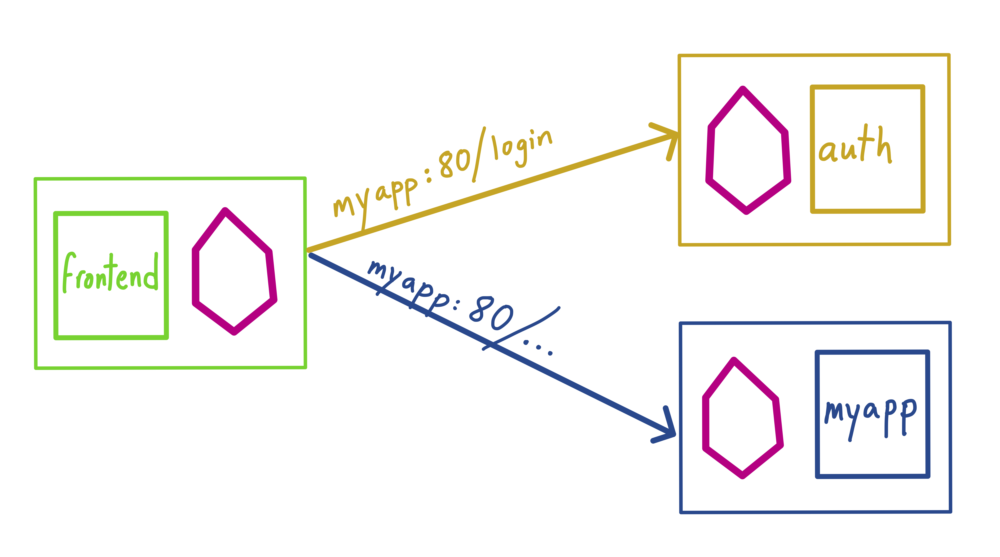

Istio and [Envoy](https://istio.io/docs/concepts/what-is-istio/#envoy) work at the Application traffic layer (L7), allowing you to direct and load-balance traffic based on attributes like HTTP headers. This example shows how to direct traffic [based on the request URI](https://istio.io/docs/concepts/traffic-management/#match-request-uri) path.

In this example, `myapp` is the server backend for a website, used by the `frontend`. An engineering team has implemented a new user authentication service, `auth`, which now operates as a separate service.

Using an Istio [match rule](https://istio.io/docs/reference/config/networking/v1alpha3/virtual-service/#HTTPMatchRequest), we redirect any request with the `/login` prefix to the new `auth` service, and direct all other `myapp` requests to the existing backend.



```YAML
apiVersion: networking.istio.io/v1alpha3
kind: VirtualService
metadata:
  name: auth-redirect
spec:
  hosts:
  - myapp
  http:
  - match:
    - uri:
        prefix: "/login"
    route:
    - destination:
        host: auth
  - route:
    - destination:
        host: myapp
```
