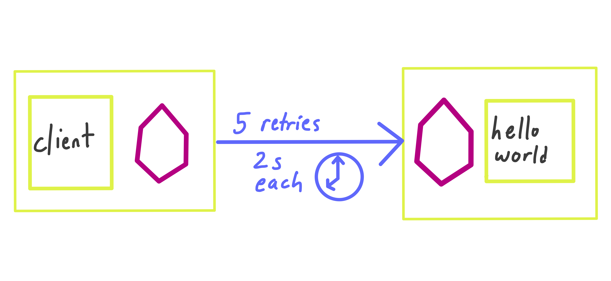

Microservices architectures are distributed. This means more requests on the network, increasing the chance of transient failures like network congestion.

Adding retry policies for requests helps build resiliency in a services architecture. Often, this retry logic is [built into source code](https://upgear.io/blog/simple-golang-retry-function/). But with Istio, you can define retry policies [with a traffic rule](https://istio.io/docs/concepts/traffic-management/#set-number-and-timeouts-for-retries), offloading this logic to your services' [sidecar proxies](https://istio.io/docs/concepts/what-is-istio/#architecture). This can help you standardize around the same policies across many services, protocols, and programming languages.



In this example, all inbound requests to the `helloworld` service try 5 times, and an attempt is marked as failed if it takes longer than 2 seconds to complete.

```YAML
apiVersion: networking.istio.io/v1alpha3
kind: DestinationRule
metadata:
  name: helloworld
spec:
  host: helloworld
  subsets:
  - name: v1
    labels:
      version: v1
```

```YAML
apiVersion: networking.istio.io/v1alpha3
kind: VirtualService
metadata:
  name: helloworld
spec:
  hosts:
  - helloworld
  http:
  - route:
    - destination:
        host: helloworld
        subset: v1
    retries:
      attempts: 5
      perTryTimeout: 2s
```